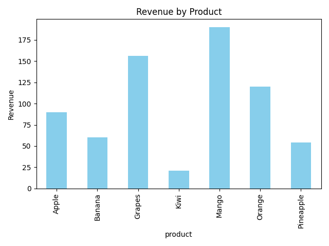

# Task 7 - Sales Summary Notebook

This project contains a **Jupyter Notebook** that performs sales data analysis using **SQLite**, **Pandas**, and **Matplotlib**. Each query is run in a separate cell, and the notebook generates a visual summary of revenue by product.

---

## Project Files

| File Name | Description |
|-----------|-------------|
| `Task7_Sales_Summary.ipynb` | Main Jupyter Notebook containing all code: database setup, data insertion, queries, and plotting. |
| `sales_data.db` | SQLite database file that stores the `sales` table and sample data. Created automatically when running the notebook. |
| `sales_chart.png` | Bar chart image of revenue by product generated from the notebook. |

---

## Features

1. **Database Setup**
   - Connects to `sales_data.db`.
   - Creates `sales` table if it doesn’t exist.
   - Inserts sample sales data only if table is empty.

2. **Queries**
   - Total quantity sold per product.
   - Total revenue per product.
   - Overall summary of total quantity and total revenue.

3. **Visualization**
   - Bar chart of revenue by product.
   - Saves chart as `sales_chart.png`.

---

## Usage

1. Open `Task7_Sales_Summary.ipynb` in **Jupyter Notebook**.
2. Run each cell sequentially:
   - Import libraries.
   - Connect to database.
   - Create table and insert sample data.
   - Execute queries.
   - Plot revenue chart.
3. The chart is displayed in the notebook and saved as `sales_chart.png`.

---

## Output

### Revenue by Product

---
